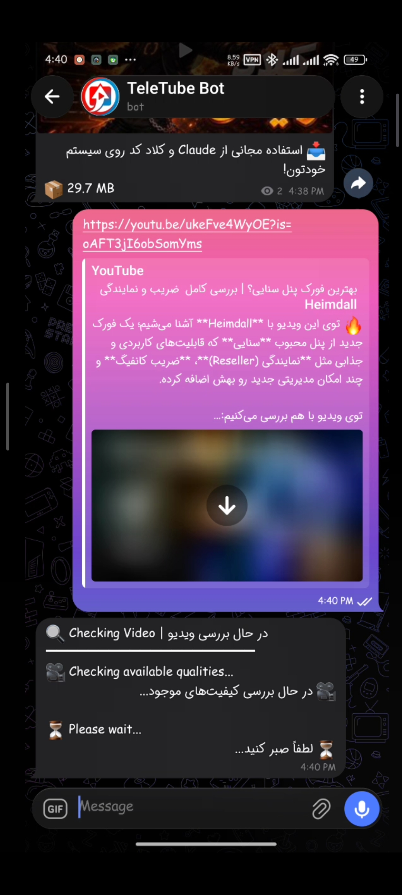
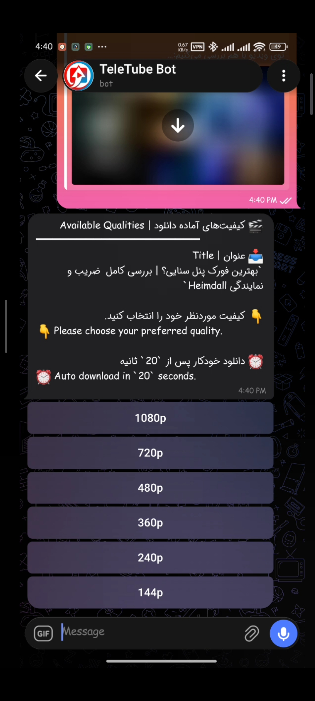
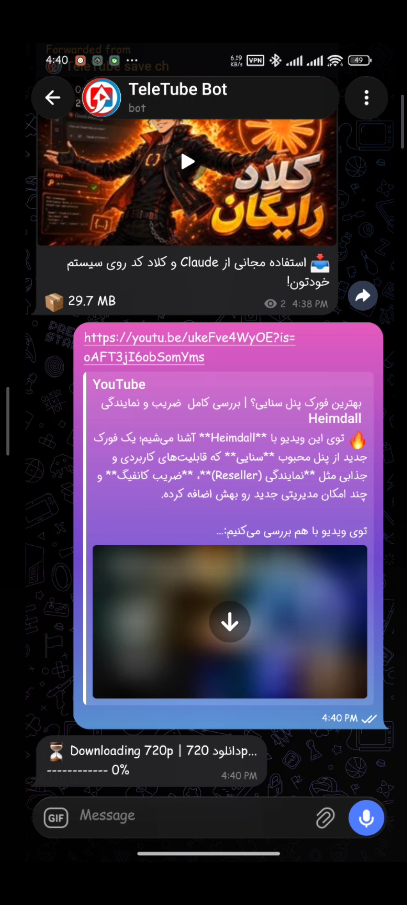
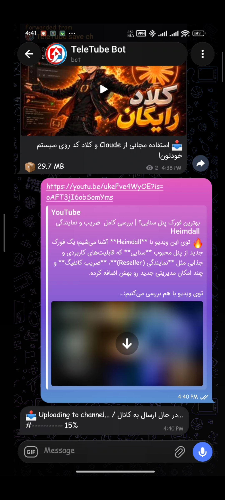
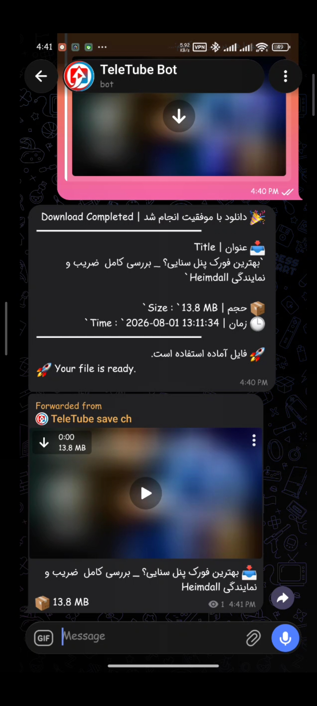

<p align="center">
  
</p>

<h1 align="center">⚡ TeleTube ⚡</h1>

<p align="center">
  <b>ربات تلگرام سریع، مدرن و متن‌باز برای دانلود ویدیوهای یوتیوب بدون محدودیت حجم آپلود ربات‌ها.</b>
</p>

<p align="center">
  <a href="README.md"><b>English</b></a> • 
  <a href="#-ویژگی‌های-کلیدی">ویژگی‌ها</a> • 
  <a href="#-شروع-سریع">راه‌اندازی سریع</a> • 
  <a href="#%EF%B8%8F-پیکربندی">پیکربندی</a> • 
  <a href="#-معماری-پروژه">معماری</a>
</p>

<p align="center">
  
  
  
  
  
</p>

---

## 📌 معرفی پروژه

ربات‌های معمولی تلگرام با محدودیت حجم آپلود شدید از طرف Bot API مواجه هستند. **TeleTube** این مشکل را با استفاده از یک معماری ترکیبی حل می‌کند:
- **python-telegram-bot** مدیریت تعاملات کاربر، منوهای شیشه‌ای و دستورات را بر عهده دارد.
- **Telethon** (لاینت اکانت شخصی) ویدیوها را با سرعت بالا و بدون محدودیت حجم در یک کانال تلگرام آپلود می‌کند.
- پس از آپلود، ویدیو به‌صورت خودکار برای کاربر فوروارد می‌شود تا تجربه‌ای سریع و بدون محدودیت فراهم گردد.

---

## ✨ ویژگی‌های کلیدی

| ویژگی | توضیحات |
| :--- | :--- |
| **🚀 دانلود پرسرعت** | قدرت‌گرفته از `yt-dlp` همراه با شتاب‌دهنده دانلود `aria2`. |
| **🎛️ منوی هوشمند کیفیت** | تشخیص خودکار کیفیت‌های موجود ویدیو و نمایش منوی شیشه‌ای جهت انتخاب. |
| **⏱️ انتخاب خودکار** | انتخاب خودکار بهترین کیفیت در صورت عدم پاسخ کاربر پس از 15 ثانیه. |
| **📦 بدون محدودیت حجم** | دور زدن محدودیت آپلود Bot API با استفاده از پروتکل MTProto (`Telethon`). |
| **📊 گزارش‌دهی زنده** | نمایش درصد پیشرفت واقعی در هر دو مرحله دانلود و آپلود. |
| **⚙️ پردازش خودکار** | ادغام فایل‌ها با FFmpeg، ساخت کاور (Thumbnail) و پاکسازی فایل‌های موقت. |
| **🔑 پشتیبانی از کوکی** | امکان دانلود ویدیوهای دارای محدودیت سنی یا محدودشده با کوکی HTTP. |
| **🛠️ مدیریت سرویس** | دارای سرویس پیش‌فرض Systemd جهت اجرا در پس‌زمینه و اجرا هنگام روشن شدن سرور. |

---

<details>
<summary>📸 برای مشاهده اسکرین‌شات ها کلیک کنید</summary>

<br>

<p align="center">
  
  
</p>

<p align="center">
  
  
</p>

<p align="center">
  
</p>

</details>

---
## 🚀 شروع سریع

### پیش‌نیازها
- **سیستم‌عامل:** Ubuntu 22.04+ / Debian 11+ (`amd64` / `arm64`)
- **سخت‌افزار:** حداقل ۱ هسته پردازنده، ۱ گیگابایت رم، ۲ گیگابایت فضای خالی

### نصب
اسکریپت نصب خودکار را اجرا کنید. این اسکریپت تمام پیش‌نیازها (پایتون، `FFmpeg`، `aria2` و `Deno`) را نصب کرده و سرویس systemd را تنظیم می‌کند:

```bash
bash <(curl -Ls https://raw.githubusercontent.com/amirh-ti/TeleTube/main/install.sh)
```
### حذف برنامه
برای حذف کامل پروژه TeleTube (شامل سرویس systemd و تمام فایل‌های نصب‌شده)، اسکریپت حذف خودکار را اجرا کنید:

```bash
bash <(curl -Ls [https://raw.githubusercontent.com/amirh-ti/TeleTube/main/uninstall.sh]
```

---

## ⚙️ پیکربندی

تنظیمات پروژه در فایل `/opt/TeleTube/.env` ذخیره می‌شوند:

```bash
nano /opt/TeleTube/.env
```

### متغیرهای محیطی

```env
# اطلاعات احراز هویت تلگرام (اجباری)
TELEGRAM_TOKEN=123456789:AA...
API_ID=12345678
API_HASH=0123456789abcdef0123456789abcdef
SESSION_STRING=1BV...

# اطلاعات کانال مقصد جهت آپلود
TARGET_CHANNEL=https://t.me/my_channel
TARGET_CHANNEL_USERNAME=@my_channel

# تنظیمات اختیاری
DOWNLOAD_DIR=/root/TeleTube/youtube_memory
COOKIES_FILE=/root/TeleTube/cookies.txt

AUTO_SELECT_TIMEOUT=15
```

---
## 🔑 پیش‌نیازها

برای استفاده از این پروژه، به **API ID** و **API Hash** تلگرام نیاز دارید.

اگر این اطلاعات را ندارید، نگران نباشید! یک راهنمای گام‌به‌گام کامل برای دریافت آن‌ها در فایل زیر آماده شده است:

[راهنمای دریافت API ID و API Hash](telegram_api_fa.md)

حتماً قبل از اجرای پروژه، این فایل را مطالعه کنید.

---

> 💡 **نکته:** اگر API ID و API Hash تلگرام رو دارید اما `SESSION_STRING` ندارید، می‌توانید با اجرای اسکریپت آماده‌ی زیر آن را از تلگرام دریافت کنید (البته بعد از نصب تله‌توب):
> ```bash
> cd /opt/TeleTube/
> pip install telethon
> python3 utils/sess_st.py
> ```
## 🛠️ مدیریت سرویس

برای کنترل و مدیریت ربات در پس‌زمینه از دستورات `systemctl` استفاده کنید:

```bash
# روشن کردن سرویس و فعال‌سازی اجرای خودکار هنگام بوت
systemctl enable --now TeleTube

# بررسی وضعیت سرویس
systemctl status TeleTube

# مشاهده لاگ‌های زنده
journalctl -u TeleTube -f

# راه‌اندازی مجدد پس از تغییر تنظیمات
systemctl restart TeleTube

# آپدیت پروژه به آخرین نسخه
TeleTube update
```

---

## 🔄 معماری و نحوه کارکرد

```text
               ┌──────────────────────────────┐
               │             کاربر تلگرام         │
               └──────────────┬───────────────┘
                              │ ارسال لینک
                              ▼
               ┌──────────────────────────────┐
               │     python-telegram-bot      │
               │     (منوی کیفیت / رابط کاربری)    │
               └──────────────┬───────────────┘
                              │
                              ▼
               ┌──────────────────────────────┐
               │        yt-dlp + aria2        │
               │      (دانلود چندنخی پرسرعت )      │
               └──────────────┬───────────────┘
                              │
                              ▼
               ┌──────────────────────────────┐
               │      FFmpeg + Thumbnail      │
               │     (مکس ویدیو و ساخت کاور)      │
               └──────────────┬───────────────┘
                              │
                              ▼
               ┌──────────────────────────────┐
               │           Telethon           │
               │     (آپلود به کانال با MTProto)     │
               └──────────────┬───────────────┘
                              │
                              ▼
               ┌──────────────────────────────┐
               │      فوروارد ویدیو برای کاربر       │
               └──────────────────────────────┘
```

---

## 📁 ساختار پروژه

```text
TeleTube/
├── bot.py                     # نقطه شروع و اصلی برنامه
├── config.py                  # ماژول خواندن متغیرهای محیطی
├── install.sh                 # اسکریپت نصب خودکار لینوکس
├── uninstall.sh               # اسکریپت حذف کامل برنامه
├── .env.example               # نمونه فایل تنظیمات
│
├── core/                      # هسته اصلی منطق برنامه
│   ├── downloader.py          # ماژول دانلود با yt-dlp و aria2
│   ├── uploader.py            # ماژول آپلود با Telethon
│   ├── qualities.py           # تشخیص و استخراج کیفیت‌ها
│   ├── thumbnail.py           # تولید کاور ویدیو
│   └── cleanup.py             # پاکسازی فایل‌های موقت
│
├── handlers/                  # هندلرهای تلگرام
│   ├── start.py               # دستور /start
│   ├── message.py             # دریافت لینک از کاربر
│   └── callback.py            # کلیک روی دکمه‌های شیشه‌ای
│
└── utils/                     # توابع کمکی، لاگر و اعتبارسنجی
```

---

## 🗺️ مسیر توسعه (Roadmap)

- [x] **نمایش حجم تقریبی فایل:** اضافه کردن حجم ویدیو کنار دکمه‌های کیفیت (مثلاً `1080p • ~145 MB`).
- [ ] **پشتیبانی از پلی‌لیست:** دانلود کامل و دسته‌ای پلی‌لیست‌های یوتیوب.
- [ ] **پشتیبانی از پلتفرم‌های دیگر:** اضافه کردن اینستاگرام، تیک‌تاک و توییتر.
- [ ] **کانتینرسازی:** ارائه فایل‌های آماده `Docker` و `Docker Compose`.

---

## 🤝 مشارکت و حمایت

مشارکت در توسعه پروژه، ارسال گزارش باگ و پیشنهادات همیشه استقبال می‌شود!

۱. پروژه را **Fork** کنید.  
۲. یک برانچ جدید بسازید (`git checkout -b feature/AmazingFeature`).  
۳. تغییرات را **Commit** کنید (`git commit -m 'Add some AmazingFeature'`).  
۴. برانچ را **Push** کنید (`git push origin feature/AmazingFeature`).  
۵. یک **Pull Request** ارسال کنید.  

اگر پروژه **TeleTube** برایتان مفید بوده، لطفاً با دادن یک **⭐ Star** در گیت‌هاب از آن حمایت کنید!

---

## 📜 تشکر و قدردانی

این پروژه با بهره‌گیری از ابزارهای فوق‌العاده متن‌باز زیر ساخته شده است:
- [python-telegram-bot](https://github.com/python-telegram-bot/python-telegram-bot)
- [Telethon](https://github.com/LonamiWebs/Telethon)
- [yt-dlp](https://github.com/yt-dlp/yt-dlp) و [yt-dlp-ejs](https://github.com/yt-dlp/yt-dlp-ejs)
- [FFmpeg](https://ffmpeg.org/) و [aria2](https://aria2.github.io/)
