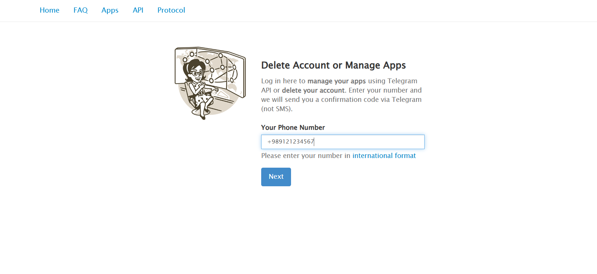
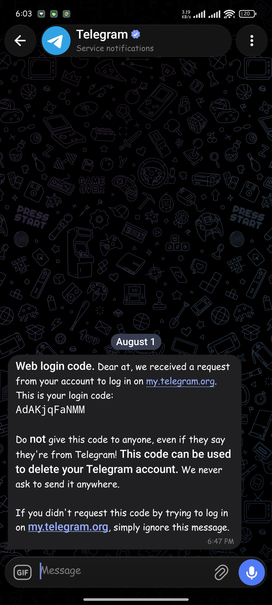
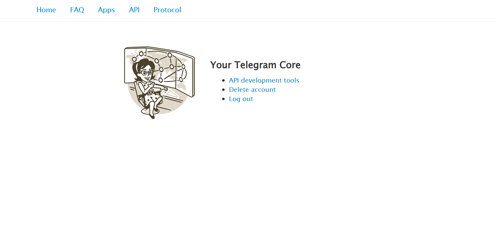
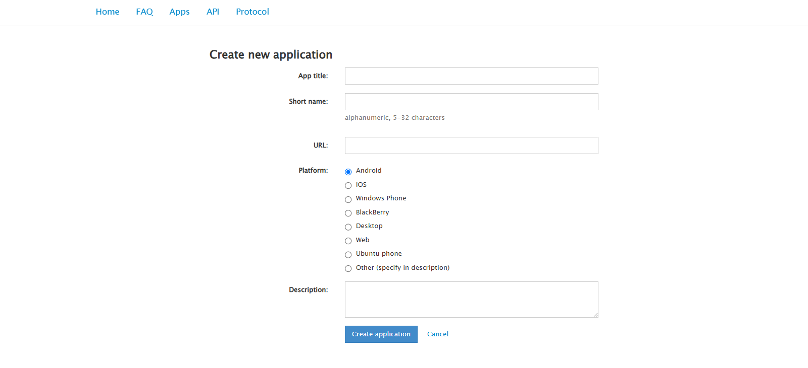
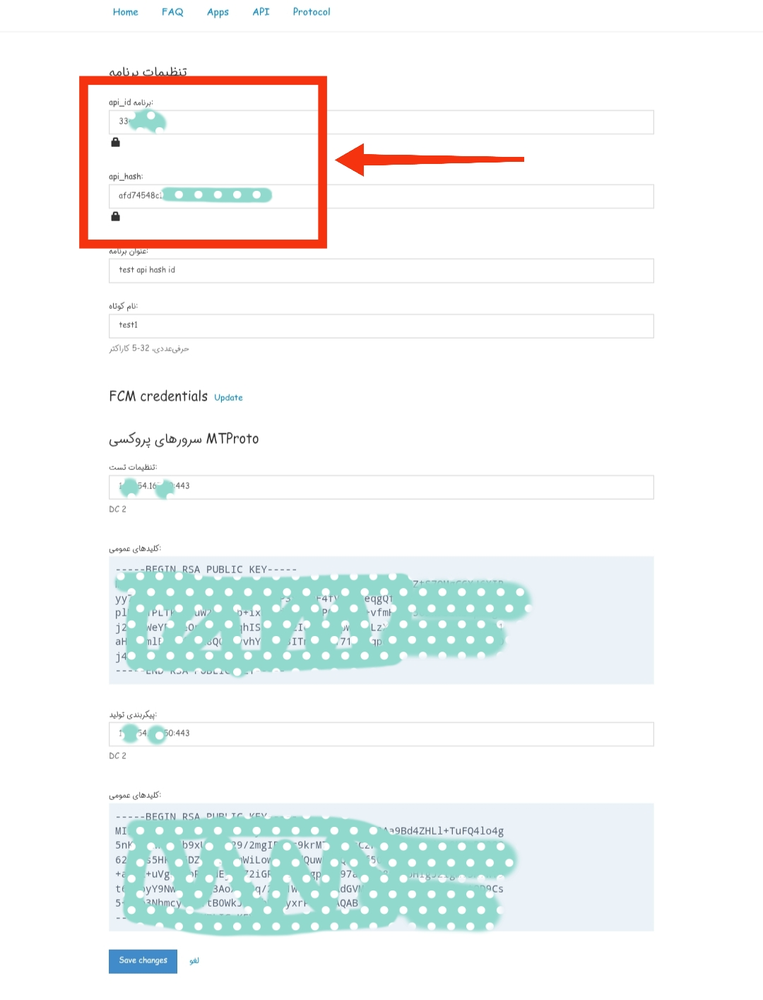

# 🔑 Guide to Getting Telegram Api_id and Api_hash
This is a complete step-by-step guide to getting `api_id` and `api_hash` from `my.telegram.org` specifically for Iranian users.

---

## 📌 Why This Guide?

If you've ever wanted to build a Telegram bot or use the Telegram API, you probably know that you need `api_id` and `api_hash`. However, due to internet restrictions and sanctions, many Iranian users can't easily obtain this information. This guide was written specifically to address this problem.

---

## 🛠 Steps (Step-by-Step)

### 1️⃣ Open my.telegram.org

Open your browser and enter the following address:

> If the site doesn't open, make sure you have a proper connection or use appropriate tools to access it.

---

### 2️⃣ Enter Your Phone Number

- Enter your mobile number **without the zero, including the country code** (e.g., `+989121234567`)
- Click the **Next** button

📸 screenshot 

 

  

---

### 3️⃣ Receive and Enter the Verification Code

- A 5-digit code will be sent to your Telegram
- Enter the code on the page and click **Sign In**

📸 screenshot 

 

  

---

### 4️⃣ Go to the API Creation Section

After logging in, click on the **API development tools** link.

📸 screenshot 

 

  

---

### 5️⃣ Create a New Application

- Click the **Create new application** button
- Fill out the form:
  - `App title`: Choose a name (e.g., `MyTelegramBot`)
  - `Short name`: Choose a short name (e.g., `mybot`)
  - `Description`: Description (optional)
- Click **Create application**

📸 screenshot 

 

  

---

### 6️⃣ Get Api_id and Api_hash

Now you will see the following information:

- **App api_id**: A number (e.g., `1234567`)
- **App api_hash**: A long string (e.g., `a1b2c3d4e5f6...`)

Save this information in a safe place.

📸 screenshot 

 

  

---

## ⚠️ Security Notes

- **Never share** your `api_id` and `api_hash` with anyone
- This information is like your password and could be misused
- If compromised, you can create a new application through the same site and deactivate the previous one

---

## ❓ Frequently Asked Questions

### Why does VPN give an error?
Because Telegram checks if your IP country matches your phone number's country. Using tools that keep your IP in Iran helps avoid this issue.

### Is this method legal?
Yes, this method is solely for bypassing sanctions restrictions and accessing Telegram's official service.

### I got a `Too many attempts` error, what should I do?
Wait a few minutes and try again.

---

## 📝 Summary

| Step | Description |
|------|-------------|
| 1 | Open my.telegram.org |
| 2 | Enter your phone number |
| 3 | Receive the verification code |
| 4 | Go to API development tools |
| 5 | Create a new application |
| 6 | Get api_id and api_hash |

---

## 🤝 Contributions

If you have suggestions to improve this guide, we'd be happy to receive a Pull Request or have you create an Issue.

---

**Good luck! 🚀**
